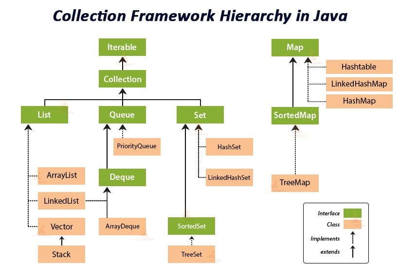

# Collections Framework

---

*"Collections Framework é um conjunto bem definido de interfaces e classes para representar e tratar grupos de dados como uma única unidade, que pode ser chamada coleção, ou collection."*

Definido a partir da versão 1.2 do JDK, este framework surgiu diante da dificuldade em implementar estruturas de dados utilizando **Arrays** ou **Vectors** ou **Hashtables**, além da falta de classes que trabalhassem estruturas como listas ligadas e tabelas de espalhamento (hash). Esse conjunto de interfaces pertencem ao pacote `java.util`.

Abaixo temos um código em Java que mostra o porque da necessidade do Collections Framework:
```java
import java.io.*;
import java.util.*;

class CollectionExample {

	public static void main(String[] args)
	{
		// Criando instâncias do array,vector e hashtable
		int arr[] = new int[] { 1, 2, 3, 4 };
		Vector<Integer> v = new Vector();
		Hashtable<Integer, String> h = new Hashtable();

		// Adicionando elementos no vetor
		v.addElement(1);
		v.addElement(2);

		// Adicionando elementos na hashtable
		h.put(1, "segunda");
		h.put(2, "terca");

		// Criação de uma instância de um array necessita [],
		// enquanto Vector e hastable pede ()
		// Inserção de elementos no Vector é por addElement(),
		// mas por hashtable é através do put()

		// Acessando o primeiro elemento do
		// array, vector e hashtable são de 3 formas diferentes
		System.out.println(arr[0]);
		System.out.println(v.elementAt(0));
		System.out.println(h.get(1));
	}
}
```
Como pudemos ver, não existia um padrão de acesso às interface. O que acabava trazendo dificuldade na hora de programar.

### Vantagens
Algumas Vantagens que o **Collections Framework** trouxe:

1. **API consitente**: contém um conjunto básico de interfaces como *Collection, Set, List ou Map*. Além de classes (*ArrayList, LinkedList, Vector, etc*) que as implementam e possuem um grupo de métodos em comum.

2. **Reduz o esforço de programação**: fornecendo estruturas de dados e algoritmos para que não precisemos escrevê-los sozinho.

3. **Aumenta o desempenho**: fornecendo implementações de alto desempenho de algoritmos e estruturas de dados úteis para que o programador apenas utilize de acordo com a situação.

### Hierarquia

As interfaces são divididas em 2 grupos:
- ***java.util.Collection***
- O primeiro grupo parte da interface **Collection** que herda um iterador da interface **Iterable**;
- todas as outras interfaces desse grupo herdam ela e por consequências seus métodos;
- interfaces: `List, Queue, Set, Deque, SortedSet`;
- classes que implementam: `ArrayList, LinkedList, Vector, PriorityQueue, HashSet, TreeSet, LinkedHashSet`.

- ***java.util.Map***
- **Não** são derivadas de **Collection**;
- Tem como interface raiz **Map** e dela herdam os métodos;
- interfaces: `SortedMap`;
- classes que implementam: `HashTable, LinkedHashMap, HashMap, TreeMap`.


