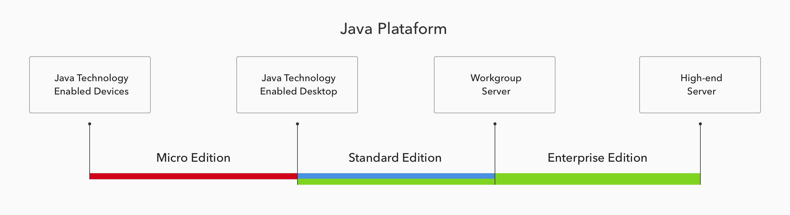
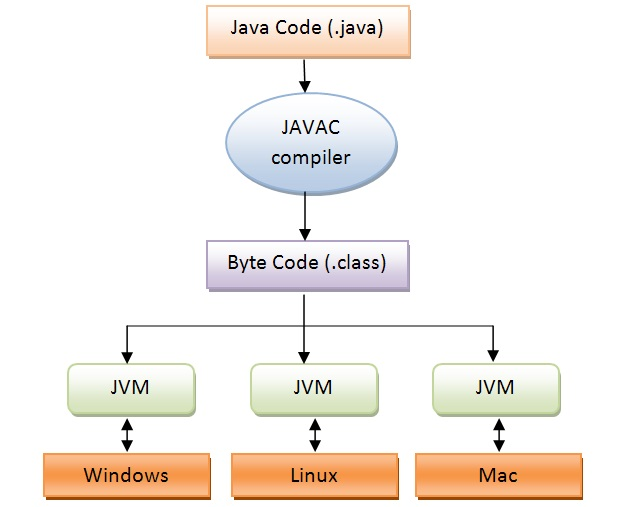

# Java: Plataforma x Linguagem

---

Java foi a primeira e é a principal linguagem da plataforma Java, a qual apoia essa linguagem através de diversas APIs e softwares, no intuito de facilitar o desenvolvimento de aplicações.

**Plataforma**: É um conjunto vasto  de tecnologias, composto por 3 principais plataformas (Java SE, Java EE, Java ME) e outra mais específica (JavaFX). Além da colaboração da comunidade, uma das grandes vantagens do Java é ser multiplataforma.

1. Principais
- Java SE (Java Platform, Standard Edition): ela contém todo o ambiente necessário para a criação de aplicações Java, incluindo a JVM, o compilador Java (javac), as APIs do Java e outras ferramentas utilitárias. Em outras palavras, é por onde deve-se começar o aprendizado.

- Java EE (Java Platform, Enterprise Edition): contém muitos elementos da plataforma Java SE. A plataforma fornece uma API e um ambiente de tempo de execução para o desenvolvimento e execução de softwares corporativos, incluindo serviços de rede e web, e outras aplicações de rede de larga escala, multicamadas, escaláveis, confiáveis e seguras.

- Java ME (Java Platform, Micro Edition): é uma tecnologia que possibilita o desenvolvimento de software para sistemas e aplicações embutidas ou embarcados, ou seja, toda aquela que roda em um dispositivo de propósito específico, desempenhando alguma tarefa que seja útil para o dispositivo.

2. Específica
- JavaFX: é uma plataforma de software multimídia desenvolvida pela Sun Microsystems baseada em java para a criação e disponibilização de Aplicação Rica para Internet que pode ser executada em vários dispositivos diferentes. A versão atual permite a criação para desktop, browser e dispositivos móveis.

**Linguagem**: É uma linguegem de programação orientada a objetos desenvolvida na década de 90 por uma equipe de programadores chefiada por James Gosling, na empresa Sun Microsystems. Em 2008 o Java foi adquirido pela empresa Oracle Corporation. Uma diferença marcante diante das outras linguagens de programação é que Java é compilada para um bytecode que é interpretado por uma máquina virtual (Java Virtual Machine).

1. Características

- Orientação a objetos - Baseado no modelo de Simular;
- Portabilidade - Independência de plataforma - "escreva uma vez, execute em qualquer lugar" ("write once, run anywhere");
- Recursos de Rede - Possui extensa biblioteca de rotinas que facilitam a cooperação com protocolos TCP/IP, como HTTP e FTP;
- Segurança - Pode executar programas via rede com restrições de execução.
- Além disso, podem-se destacar outras vantagens apresentadas pela linguagem:

- Sintaxe similar a C/C++
- Facilidades de Internacionalização - Suporta nativamente caracteres Unicode;
- Simplicidade na especificação, tanto da linguagem como do "ambiente" de execução (JVM);
- É distribuída com um vasto conjunto de bibliotecas (ou APIs);
- Possui facilidades para criação de programas distribuídos e multitarefa (múltiplas linhas de execução - num mesmo programa);
- Desalocação de memória automática por processo de coletor de lixo;
- Carga Dinâmica de Código - Programas em Java são formados por uma coleção de classes armazenadas independentemente e que podem ser carregadas no momento de utilização.

## Outras Terminologias

- JVM: é um programa que carrega e executa os aplicativos Java, convertendo os bytecodes oriundos do compilador Javac em código executável de máquina. A JVM é responsável pelo gerenciamento dos aplicativos, à medida que são executados.

- Java Runtime Environment (JRE): significa Ambiente de Tempo de Execução Java, e é utilizado para executar as aplicações da plataforma Java. É composto por bibliotecas (APIs) e pela Máquina virtual Java (JVM).

- Java Development Kit (JDK): significa Kit de Desenvolvimento Java, e é um conjunto de utilitários que permitem criar sistemas de software para a plataforma Java. É composto por compilador e bibliotecas. Ou seja, como desenvolvedor, você só precisa ter o JDK para poder desenvolver sua aplicação, pois ela já contém o JRE.

- Garbage Collector: é uma thread responsável pela limpeza da memória virtual, ou seja, quando exite muito lixo na memória virtual, ele entra em ação.

Etapas do processo de compilação:

