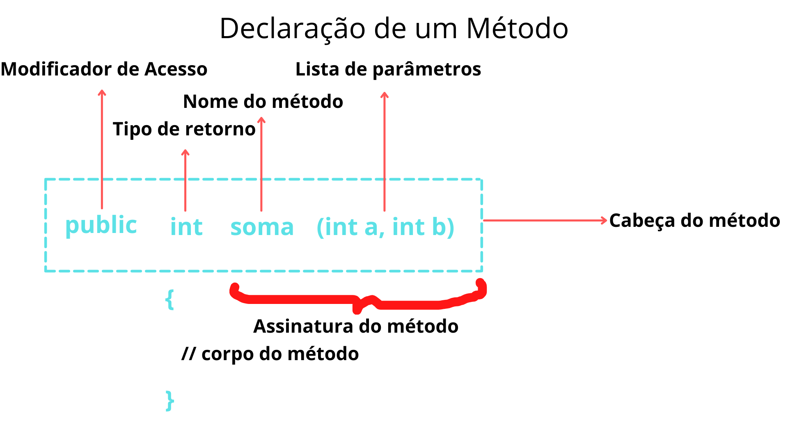

# Métodos

---

Um método é um bloco de código que quando invocado, executa uma tarefa específica. Em java, método é equivalente a uma função.

***IMPORTANTE***
Não existe em Java o conceito de métodos globais. Todos os métodos devem sempre ser definidos dentro de uma classe.

### Vantagens

- Capacidade de reutilização: uma  vez que já temos um determinado bloco de código pronto dentro de um método, basta invocá-lo onde for necessário.

- Elimina repetição de código

- Modificação fácil: uma vez que precisamos apenas alterar dentro do método e em todo lugar que ele fi invocado, será altrerado automaticamente

- Legibilidade: elimina todo aquele *boilerplate* tornando o código mais enxuto e organizado

### Declaração de um método

É possível separar a declaração de um método em 6 elementos como mostra a figura abaixo.



- **Assinatura do método**: basicamente todo método possui. É o que difere um método de outro e é composto pelo nome  e parâmetros.

- **Modificadores de acesso**: indica o tipo de acesso, ou visibilidade, do método. São basicamente 4 tipos:
    1. Public: O método é acessível por todas as classes na aplicação. (**Menos restritivo**);
    2. Private: O método é acessível apenas pelos métodos da própria classe. (**Mais restritivo**) ;
    3. Protected: O método é acessível pelos métodos da própria classe e pelas classes derivadas;
    4. Default: Quando não especificamos o modificador. É acessível por todos dentro do mesmo pacote.

- **Tipo de Retorno**: é referente ao tipo de dado que o método retorna. Isso pode ser um tipo primitivo, objeto, coleção, void, etc. Caso o método não retorne nada, utilizar a palavra-chave *void*.

- **Nome do método**: é um nome único dado ao método. 
    - Convenção:
    1. O nome deve ser correspondente a funcionalidade do método;
    2. Deve ser um verbo;
    3. Iniciar com letra minúscula e seguir com *camel case* em caso de mais palavras;
    4. Segue as mesmas regras da criação de uma variável.

- **Parâmetros(ou argumentos)**: é possível ter 0 ou mais argumentos. Se for 0, os parênteses ficam vazios. Em caso de mais argumentos, devem ser declarados dentro do parênteses assim como as variáveis. Devem estar separados por vírgula.

- **Corpo**: é tudo que está dentro das chaves e performa todas as ações contidas no método.

### Método main()

É o ponto de start para a JVM começar a execução de um programa em Java.

**Syntax**:
```java
public static void main(String args[]){}
```

- public: refere-se a visibilidade do método. Ou seja, tem o nível menos restritivo.
- static: informa que podemos invocar o método sem precisar criar objetos.
- void: não retorna nenhum valor
- main(): é a assinatura default predefinida pela JVM
- String args[]: usado para manter os argumentos da linha de comando na forma de valores de string.

*CURIOSIDADE*
O que acontece se o método **main()** não for escrito com **String args[]**?
O programa irá compilar, mas não irá executar, porque a JVM não reconhecerá o método main().