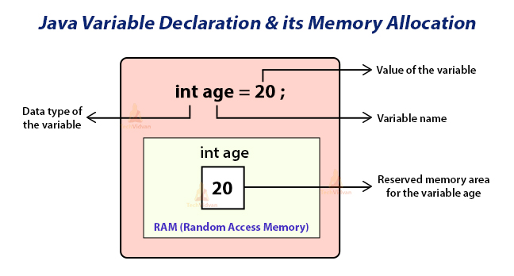

# Tipos de dados, variáveis e constantes
### Tipos de dados
O Java é uma linguagem fortemente tipada. Isso significa que a declaração do tipo é obrigatória, seja na declaração de variáveis, passagem de parâmetros...
```java
public class TiposDados {
    public static void main(String[] args) {
        idade = 28; //idade cannot be resolved to a variableJava(33554515)
    }
}
```

Além dissso, o Java tem uma tipagem estática, que não permite ao desenvolvedor alterar o tipo da variável depois de declarada.
```java
public class TiposDados {
    public static void main(String[] args) {
        int idade = 28;

        idade = '28'; // Invalid character constantJava(1610612989)
    }
}
```

##### Vantagens:
* Equívocos de tipagem geralmente são percebidos com mais facilidade
* Processos de refatoração tendem a ser mais a prova de equívocos

##### Desvantagens:
* Tende a ser mais verbosa, por ter que sempre declarar os tipos das variáveis
* Não realizam conversões automaticamente

#### Tipos de dados padrões no java (Primitivos e Por referência)
##### Primitivos:
- **Byte**: um inteiro com valor 8 bits, onde seu intervalo de valores vai do -128 até o 127. É um dado leve, que ocupa pouco espaço em memória;
- **Char**: trata-se de um único caractere unicode de 16 bits. Seu intervalo de valores vai do ‘\u0000’ ou 0 até o valor máximo ‘\uffff’ ou 65535. É utilizado para armazenar caracteres de maneira isolada;
- **Short**: trata-se de um valor inteiro de 16 bits. Seu intervalo de valores vai do -32.768 até o 32.767;
- **Int**: trata-se de um valor inteiro de 32 bits. Suporta valores de -2.147.483.648 a 2.147.483.647;
- **Long**: define um valor inteiro de 64 bits. Suporta valores de -9.223.372.036.854.775.808 a 9.223.372.036.854.775.807;
- **Boolean**: é um dos tipos de dados mais simples, pois ele pode armazenar apenas dois valores: true (verdadeiro) ou false (falso). É empregado para realizar testes lógicos, dentro de estruturas de decisão e repetição, por exemplo.
-  **Float**: trata-se de um tipo de dado de ponto flutuante de 32 bits. Isso quer dizer que ele permite armazenar valores decimais entre 6 e 7 casas. Porém, o armazenamento em memória pode não representar necessariamente o valor repassado. Por exemplo, um float definido com “0,001” pode acabar sendo armazenado como “0,00100001”, e isso não somente no Java, já que isso é decorrência dos pontos flutuantes em geral. Por isso, o tipo float não deve ser usado para operações que precisam passar por várias operações aritméticas, como no caso de sistemas financeiros. Isso porque, a primeira vista, essa imprecisão pode não impactar, mas na sequência de operações realizadas, estas imprecisões podem começar a aparecer nos resultados;
- **Double**: representa um ponto flutuante de 64 bits. Por isso, ele permite armazenar números de até cerca de 15 casas decimais. A observação para o tipo float também é válida para o tipo double: por ser um tipo de dado que é armazenado por aproximação de valores, ele não deve ser utilizado em operações que demandam precisão absoluta.

##### Por Referência
- **Strings**,**Arrays Primitivos**,**Objetos** : Os dados por referência são utilizados para armazenar as localizações dos objetos da memória do computador. Dentro desses objetos podem existir variáveis de instância e métodos. 

### Variáveis
As variáveis são posições na memória do computador que podem armazenar dados. 
Uma variável pode ser declarada informando seu tipo de dado, seguido de seu nome. Pode ser dado um valor a ela ou não.



**Regras e Convenções** para nomeação de variáveis:
1. Pode conter letras, números e o caractere sublinhado (_), mas não pode começar com um número;
2. Devem ser declaradas em minúsculo. Caso sejam nomes compostos, a primeira letra de todas as palavras, menos da primeira, deve ser maiúscula (Camel Case);
3. Java é uma linguagem case sensitive. Assim, *empresaAlfa* é diferente de *empresaalfa*.
4. Não devem conter espaços
5. Não podem ser palavras reservadas

**Boas Práticas**
* Sempre começar com letra minúscula;
* Ter nomes expressivos;
* Notação Camel Case.


*DICA*: Embora permitido, "$" e "_" devem ser evitados na declaração das variáveis.


### Constantes
As constantes são melhor entendidas junto com o conceito de orientação a objetos e classes.
Quando precisamos lidar com dados que não devem ser alterados durante a execução do programa, utilizamos as constantes. No Java declaramos uma constante utilizando as palavras-chave ***static final*** antes do tipo da variável.

*ex.:* 
```java
package primeirospassos;

public class TiposDados {
    public static final float PI = 3.1416F;

    public static void main(String[] args) {
      System.out.println(PI);
    }
}
```
**Boas Práticas**
* Sempre em letras maiúsculas e separadas por "_" quando mais de uma palavra

*DICA*: *"Constantes são indicadas para substituir “números/valores mágicos”, isto é, aqueles números que aparecem no meio do código criado para realizar algum cálculo, agregando mais significado e facilitando a compreensão."*